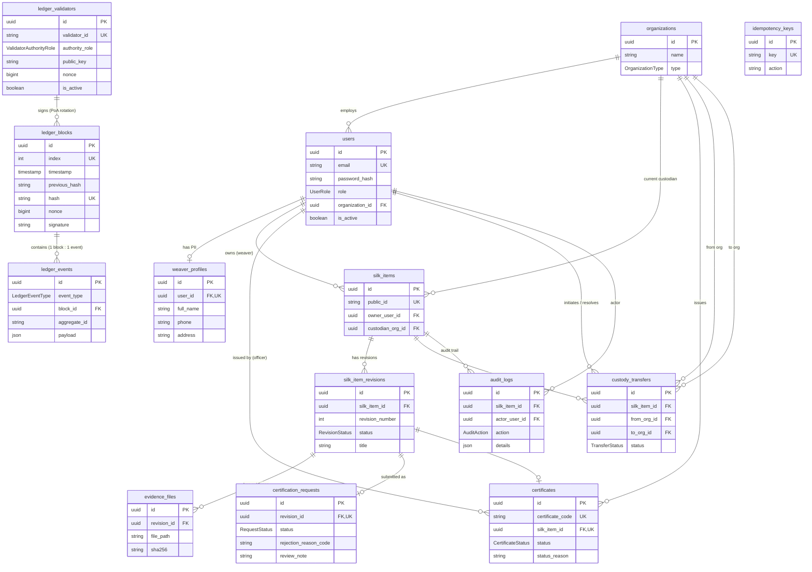

# Database Design

สถานะเอกสาร: **Implemented** — สอดคล้องกับ `docs/system-design.md` (source of truth)

อ้างอิงหลัก: system-design.md หัวข้อ 7 (State Models), 10 (Data Design), 11 (Pseudo-code), 15 (Failure and Edge Cases), 21 (Seed Data)

Technology: PostgreSQL 17 + Prisma ORM 7 (generator `prisma-client`, driver adapter `@prisma/adapter-pg`, client singleton ที่ `server/utils/db.ts`)

---

## 1. หลักการออกแบบ

1. **แยก Workflow / Read Model / Ledger Simulation** — ตารางธุรกิจ (แก้ไขได้ตาม workflow) แยกจากตาราง ledger (append-only บังคับด้วย DB trigger) ตาม system-design.md §10.5
2. **Atomicity** — Ledger Block และ Business State เปลี่ยนพร้อมกันใน Prisma Transaction เดียว (§9, §10.6) schema ออกแบบให้ทุก invariant ที่วิกฤตถูกบังคับที่ฐานข้อมูล ไม่พึ่ง application เท่านั้น
3. **UUID internal + public code แยก** — internal ID เป็น UUID ส่วน `silk_items.public_id` และ `certificates.certificate_code` เป็นรหัสสุ่มที่คาดเดายากสำหรับ URL/QR (§10.6)
4. **PDPA** — PII ของช่างทอแยกอยู่ใน `weaver_profiles` ตารางเดียว จำกัดสิทธิ์การเข้าถึง ไม่มี PII ใน ledger payload และไม่มี PII ในหน้า public
5. **ความเรียบง่าย** — ไม่มี Generic Repository Layer, ไม่มีตารางเกินความจำเป็น ทุกตาราง map กลับไปยัง requirement ใน system-design.md ได้

## 2. ER Diagram



## 3. ตารางและเหตุผล

### 3.1 Identity & Access

| ตาราง | เหตุผล / ข้อกำหนด |
|---|---|
| `organizations` | สหกรณ์ (COOPERATIVE) และร้านค้า (STORE) — เป็นคู่ความเป็นเจ้าของ/ผู้รับฝาก (custody) ทั้งหมดเป็นระดับองค์กรตาม on-chain data "Custody From/To Organization ID" (§10.2) |
| `users` | บัญชีทุก role ตาม §4/§21; `password_hash` ใช้กับ nuxt-auth-utils; `is_active` รองรับกรณี "ระงับบัญชี" ใน §15 |
| `weaver_profiles` | PII (ชื่อเต็ม เบอร์โทร ที่อยู่) แยกตารางตาม §10.3 เพื่อจำกัดสิทธิ์และกำกับ retention แยกจากบัญชี |

### 3.2 Silk Item Workflow

| ตาราง | เหตุผล / ข้อกำหนด |
|---|---|
| `silk_items` | ผ้าหนึ่งผืนต่อ certificate หนึ่งใบ (MVP §3.1); `public_id` สุ่มคาดเดายาก; `custodian_org_id` = ผู้ดูแลปัจจุบัน เปลี่ยนเฉพาะเมื่อ TRANSFER_ACCEPTED |
| `silk_item_revisions` | Snapshot ข้อมูลที่ขอรับรอง ตาม §7.1 — REJECTED ต้องสร้าง revision ใหม่ (unique `(silk_item_id, revision_number)`); ข้อมูล claim ทั้งหมด (title/pattern/material/technique/ขนาด/วันทอ) อยู่ที่ revision เพราะ "หลัง APPROVED ห้ามเขียนทับ" |
| `evidence_files` | Metadata + SHA-256 ของไฟล์เท่านั้น ไฟล์จริงอยู่ใน local storage (§2) — hash ถูก anchor ลง ledger เมื่ออนุมัติ (§10.2) |
| `certification_requests` | คิวตรวจของสหกรณ์ (§5.2 `/review`); `revision_id` unique → revision หนึ่งถูก submit ได้ครั้งเดียว การส่งใหม่หลังถูกปฏิเสธคือ revision ใหม่ (§6.2); เก็บ reason code + review note ตาม §11.3 |
| `certificates` | Read model สาธารณะ (§10.1); `certificate_code` unique สำหรับ URL/QR; `silk_item_id` unique → ผ้าหนึ่งผืนมี certificate สูงสุดหนึ่งใบ (§10.6); `status_reason`/`status_changed_at` denormalize สำหรับ public page (§12) ประวัติเต็มอยู่ใน `audit_logs` + ledger |
| `custody_transfers` | สถานะตาม §7.3; partial unique index บังคับ PENDING เดียวต่อ silk item (§10.6); `reason` ใช้ทั้ง rejection/cancellation |

### 3.3 Local Blockchain Simulation (Append-only)

| ตาราง | เหตุผล / ข้อกำหนด |
|---|---|
| `ledger_blocks` | ฟิลด์ครบตาม §10.4: `index` (unique), `timestamp`, `data_hash`, `nonce` (validator sequence), `previous_hash`, `hash` (unique), `validator_id` (FK), `signature`; หนึ่ง block ต่อหนึ่ง domain event (§10.7); **UPDATE/DELETE ถูกปฏิเสธด้วย trigger** |
| `ledger_events` | `event_type` (6 ค่าตาม §10.7), `aggregate_id` = `silk_items.public_id` (anchor เดียวสำหรับ explorer/verify), `payload` JSON ไม่มี PII, `actor_id` เป็น string ID ที่ไม่เปิดเผย PII (§10.2); **append-only เช่นกัน** |
| `ledger_validators` | Validator 3 บทบาทตาม §8.2; เก็บ **public key เท่านั้น** private key อยู่ที่ `VALIDATOR_KEY_DIR` บน server ห้ามเข้า DB/Git (§10.6); `nonce` เพิ่มทีละหนึ่งต่อ block ที่ validator นั้นลงนาม (§10.2) |

### 3.4 Cross-cutting

| ตาราง | เหตุผล / ข้อกำหนด |
|---|---|
| `audit_logs` | Audit trail ภายใน (§5.2 `/audit/:silkItemId`) สำหรับ action ที่ **ไม่สร้าง block** (draft/submit/reject/transfer initiate/cancel ฯลฯ ตาม §10.7 ท้ายบท) — ตรงกับ "CREATE workflow audit log" ใน §11.1 |
| `idempotency_keys` | กลางเดียวสำหรับ mutation สำคัญทุกตัว (submit/approve/reject/status change/transfer initiate/accept) ตาม §10.6 และ pseudo-code §11.1–11.2 ที่เช็ค idempotencyKey ทั้งก่อน submit และ approve; unique ทำให้ retry เป็น conflict ไม่ใช่ duplicate effect |

## 4. Enums

| Enum | ค่า | ที่มา |
|---|---|---|
| `UserRole` | WEAVER, COOPERATIVE_OFFICER, STORE_USER | §4, §21 |
| `OrganizationType` | COOPERATIVE, STORE | §10.1 |
| `RevisionStatus` | DRAFT, SUBMITTED, APPROVED, REJECTED | §7.1 |
| `RequestStatus` | SUBMITTED, APPROVED, REJECTED | §7.1 (สถานะ request หลัง submit) |
| `CertificateStatus` | ACTIVE, SUSPENDED, REVOKED | §7.2 |
| `TransferStatus` | PENDING, ACCEPTED, REJECTED, CANCELLED, EXPIRED | §7.3 |
| `ValidatorAuthorityRole` | COOPERATIVE_AUTHORITY, LOCAL_CERTIFIER_AUTHORITY, RETAIL_NETWORK_AUTHORITY | §8.2 |
| `LedgerEventType` | GENESIS, ISSUE_CERTIFICATE, TRANSFER_ACCEPTED, CERTIFICATE_SUSPENDED, CERTIFICATE_REACTIVATED, CERTIFICATE_REVOKED | §10.7 |
| `AuditAction` | REVISION_CREATED, EVIDENCE_UPLOADED, SUBMITTED_FOR_CERTIFICATION, CERTIFICATION_APPROVED, CERTIFICATION_REJECTED, CERTIFICATE_SUSPENDED, CERTIFICATE_REACTIVATED, CERTIFICATE_REVOKED, TRANSFER_INITIATED, TRANSFER_ACCEPTED, TRANSFER_REJECTED, TRANSFER_CANCELLED | §11, /audit route |

## 5. Constraints และ Indexes

### Unique (บังคับโดยฐานข้อมูล)

| Constraint | ผลลัพธ์ที่กัน |
|---|---|
| `users.email` | บัญชีซ้ำ |
| `silk_items.public_id` | รหัสผ้าซ้ำ |
| `certificates.certificate_code` | รหัสใบรับรองซ้ำ |
| `certificates.silk_item_id` | **ผ้าหนึ่งผืนได้ certificate สูงสุดหนึ่งใบ** (§10.6) — กัน concurrent approve (§15) |
| `certificates.revision_id` | snapshot รับรองซ้ำ |
| `certification_requests.revision_id` | **revision หนึ่ง submit ได้ครั้งเดียว** — กัน duplicate submit (§15) |
| `silk_item_revisions (silk_item_id, revision_number)` | เลข revision ซ้ำ |
| `ledger_blocks.index`, `ledger_blocks.hash` | ลำดับ/hash ซ้ำ (§10.6) |
| `ledger_validators.validator_id` | validator id ซ้ำ |
| `idempotency_keys.key` | retry ซ้ำ (§10.6) |
| `custody_transfers_silk_item_id_pending_key` (partial: `WHERE status='PENDING'`) | **PENDING transfer เดียวต่อ silk item** (§10.6) — กันร้านค้าสองแห่งรับพร้อมกัน (§15) |

### Indexes (ตาม §10.6 + FK ที่ query บ่อย)

`certificates.certificate_code` (unique), `silk_items.owner_user_id`, `silk_items.custodian_org_id`, `certification_requests.status`, `custody_transfers.to_org_id`, `custody_transfers.from_org_id`, `custody_transfers.status`, `silk_item_revisions.silk_item_id/status`, `evidence_files.revision_id`, `ledger_events.aggregate_id/block_id/event_type`, `ledger_blocks.validator_id`, `audit_logs.silk_item_id/action`, `users.organization_id`

### Append-only Triggers

`ledger_blocks`, `ledger_events` มี trigger `BEFORE UPDATE OR DELETE` ที่ RAISE EXCEPTION เสมอ (ทดสอบแล้วทั้ง UPDATE และ DELETE) — ตาม §10.6 หากจำเป็นต้องแก้ข้อมูลใน migration ให้ใช้ `SET session_replication_role = replica` ชั่วคราว

## 6. On-chain / Off-chain

| ข้อมูล | ที่เก็บ |
|---|---|
| Event type, silk item public id, certificate code, org ids, actor id, revision/evidence hash, reason code, timestamp, validator id, nonce, signature | **On-chain (ledger_events payload + ledger_blocks)** — ไม่มี PII |
| ชื่อเต็ม/เบอร์โทร/ที่อยู่ช่างทอ, password hash, ไฟล์รูป/เอกสารเต็ม, review note ของเจ้าหน้าที่ | **Off-chain (weaver_profiles / users / local storage / certification_requests)** |
| ข้อมูล claim ของผ้า (title, ลาย, วัสดุ, ขนาด) | Off-chain ใน `silk_item_revisions` โดย **hash ของ revision ลง ledger** ตอน ISSUE_CERTIFICATE — แก้ข้อมูลหลังออกใบรับรองไม่ได้โดยไม่ทำให้ hash ไม่ตรง |

## 7. Transaction และ Concurrency Strategy

ทุก mutation สำคัญรันใน Prisma interactive transaction เดียว (§10.6 ท้ายหัวข้อ):

```text
approveCertification:
  BEGIN
  INSERT idempotency_keys (unique กัน retry)
  SELECT ... FOR UPDATE บน certification_requests (กัน approve ซ้อน)
  SELECT pg_advisory_xact_lock(<ledger lock id>)     -- serialize การเขียน chain (§10.6)
  อ่าน latest ledger_blocks → คำนวณ hash + เลือก validator ตาม round-robin + ลงนาม Ed25519
  INSERT ledger_blocks + ledger_events
  INSERT certificates (unique silk_item_id กันซ้ำระดับสุดท้าย)
  UPDATE certification_requests → APPROVED, UPDATE silk_item_revisions → APPROVED
  INSERT audit_logs
  COMMIT  -- ขั้นตอนใดล้มเหลวทั้งหมด rollback

acceptTransfer:
  BEGIN
  INSERT idempotency_keys
  SELECT ... FOR UPDATE บน custody_transfers (สถานะต้องเป็น PENDING)
  pg_advisory_xact_lock → สร้าง TRANSFER_ACCEPTED block
  UPDATE custody_transfers → ACCEPTED, UPDATE silk_items.custodian_org_id = to_org
  COMMIT
```

ชั้นป้องกันซ้อนกัน 3 ชั้น: idempotency key (กัน retry เดิม) → row lock + state guard (กัน race) → unique/partial index (กันเหลือรอด) ตาม §15

## 8. PDPA และ Security

- PII อยู่เฉพาะ `weaver_profiles` (+ email ใน `users`) — เข้าถึงผ่าน server route ที่ตรวจสิทธิ์เท่านั้น ไม่มีทางเข้า public read path
- `ledger_events.payload` บรรจุเฉพาะ ID/code/hash — ตาม §10.2
- Private key ของ validator ไม่มี column ใดเก็บ — อยู่ที่ `VALIDATOR_KEY_DIR` server-only
- ไฟล์หลักฐานเข้าถึงผ่าน authorized route เท่านั้น `storage/uploads` ไม่ถูก serve เป็น static (§14.4)
- FK ทั้งหมด `ON DELETE RESTRICT` (default ของ required relation) — ประวัติที่ยืนยันแล้วไม่ถูกลบตาม parent (§17)

## 9. Assumptions (จุดที่เอกสารไม่ได้ล็อก)

| # | Assumption | เหตุผลที่เลือกแนวนี้ |
|---|---|---|
| A1 | Custody เป็นระดับองค์กร; weaver สังกัด cooperative; custodian เริ่มต้น = องค์กรของ weaver ตอนสร้าง item | on-chain ใช้ "From/To Organization ID" (§10.2) และ seed สร้างบัญชีให้ ไม่มี self-register (§3.2) |
| A2 | Evidence ผูกกับ revision ไม่ใช่ silk item | การรับรองตรวจ snapshot ของการส่งครั้งนั้น (§6.1) และ hash ตอน approve ต้องครอบ evidence ของ revision นั้น |
| A3 | `rejection_reason_code` / reason code เป็น String (ไม่ใช่ DB enum) ตรวจสอบด้วย zod ที่ API layer | รายการ reason ยังไม่ยืนยันกับ requirement จริง เปลี่ยน enum ใน DB กระทบ migration ทุกครั้ง |
| A4 | `idempotency_keys` เป็นตารางกลาง (ไม่ใช่ column ในแต่ละตาราง) เพราะ approve/reject/accept เป็นการ update ไม่ได้สร้างแถวใหม่ | §11.1–11.2 เช็ค idempotencyKey ทั้ง submit และ approve — ตารางกลางครอบคลุมทุก mutation แบบเดียวกัน |
| A5 | MVP ไม่เก็บผลลัพธ์ idempotency response — key ซ้ำได้รับ conflict แล้ว refetch state | ง่ายและเพียงพอกับ §15 (กัน duplicate effect) |
| A6 | `ledger_events.aggregate_id` = `silk_items.public_id` (null เฉพาะ GENESIS) | anchor เดียวทำให้ query explorer/verify ต่อ item ง่าย ทุก event ใน catalog สัมพันธ์กับ silk item |
| A7 | `actor_id` ใน ledger เป็น String (user/org UUID) ไม่ทำ FK | §10.2 ระบุ "ไม่เปิดเผย PII โดยตรง" และ ledger append-only ควรไม่ผูกกับแถวที่ mutate ได้ |
| A8 | Internal ID ใช้ UUIDv4 (`uuid()`) | Prisma 7.9 ไม่มี `uuidv7()` ใน PSL และเอกสารไม่ได้กำหนดเวอร์ชัน UUID |
| A9 | `organizations.type` มีแค่ COOPERATIVE, STORE | validator อยู่ใน `ledger_validators` แยกต่างหากตาม §10.5 ส่วน certifier authority เป็น validator role ไม่ใช่ business org |

## 10. การตรวจสอบความสอดคล้องกับ system-design.md

| ข้อกำหนด (§10.6 และอื่น ๆ) | สถานะ |
|---|---|
| UUID internal + `certificate_code` public | ✅ |
| Unique: `users.email`, `silk_items.public_id`, `certificates.certificate_code`, `ledger_blocks.index`, `ledger_blocks.hash` | ✅ |
| Unique `certificates.silk_item_id` (ผ้า 1 ผืน 1 ใบรับรอง) | ✅ |
| Partial unique index PENDING transfer | ✅ (migration SQL + ทดสอบแล้ว) |
| `idempotency_key` บังคับ unique | ✅ (ตาราง `idempotency_keys`) |
| Advisory lock ก่อน append block | ⏳ App-layer (documented §7 ของเอกสารนี้ — ใช้ตอน implement service) |
| Trigger ปฏิเสธ UPDATE/DELETE บน ledger | ✅ (migration SQL + ทดสอบแล้ว) |
| `created_at`/`updated_at` ทุกตาราง workflow; ledger ใช้ `created_at` เท่านั้น | ✅ |
| Index ตามที่ระบุ + FK ที่ใช้บ่อย | ✅ |
| Private key ห้ามอยู่ใน DB | ✅ (ไม่มี column; เก็บที่ `VALIDATOR_KEY_DIR`) |
| State models §7 (revision/certificate/transfer) | ✅ (enums ตรงตาม) |
| Ledger event catalog §10.7 (6 event, 1 block : 1 event) | ✅ |
| Audit trail สำหรับ workflow ที่ไม่ลง ledger | ✅ (`audit_logs`) |
| Seed ตาม §21 | ⏳ Pending by design (phase ถัดไป — ยังไม่มี `prisma/seed.ts`) |
