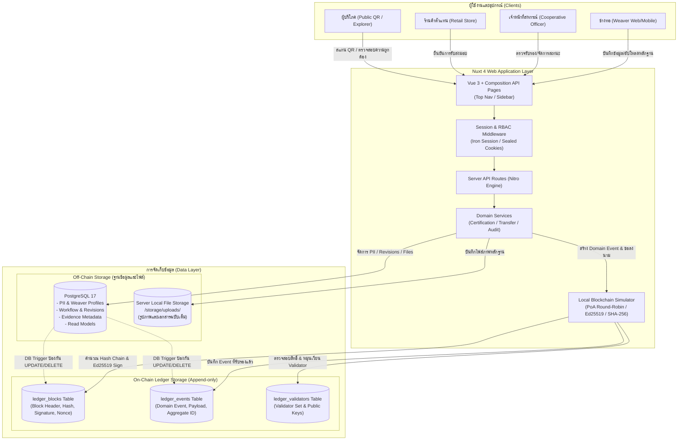

# 2. Solution Architecture — สถาปัตยกรรมระบบและบล็อกเชน

## 2.1 ภาพรวมสถาปัตยกรรมระบบ (System Architecture)

ระบบการรับรองแหล่งที่มาผ้าไหมทอมือบุรีรัมย์ (Buriram Silk Traceability System) ถูกออกแบบบนโครงสร้าง **Nuxt 4 Full-Stack Web Application** ร่วมกับ **Local Blockchain Simulation** เพื่อสาธิตการทำงานของ Consortium Blockchain บนมาตรฐาน Proof of Authority (PoA) โดยแยกการจัดเก็บข้อมูลทางธุรกิจ (Business & PII) ออกจากบัญชีธุรกรรมที่ไม่สามารถแก้ไขได้ (Append-only Ledger)



---

## 2.2 ประเภทบล็อกเชนและเหตุผลการเลือก: Consortium Blockchain

ระบบเลือกใช้ **Consortium Blockchain (บล็อกเชนแบบพันธมิตร)** โดยมีเหตุผลสนับสนุนดังนี้:

1. **การควบคุมสิทธิ์ในการบันทึก (Permissioned Write):** การออกใบรับรองแหล่งกำเนิดผ้าไหมจำเป็นต้องจำกัดเฉพาะหน่วยงานที่มีอำนาจหน้าที่จริง (เช่น สหกรณ์ผ้าไหม, หน่วยงานตรวจรับรอง) ไม่สามารถเปิดให้บุคคลทั่วไปเขียนข้อมูลลงบัญชีธุรกรรมได้ตามใจเหมือน Public Blockchain
2. **การเข้าถึงเพื่อตรวจสอบแบบสาธารณะ (Public Read):** ผู้บริโภคและบุคคลทั่วไปสามารถเรียกดูข้อมูลใบรับรอง ตรวจสอบสถานะ และตรวจสอบความถูกต้องสมบูรณ์ของสายโซ่บล็อก (Chain Integrity) ได้อย่างอิสระโดยไม่ต้องผ่านกระบวนการลงทะเบียน
3. **การกระจายอำนาจระหว่างหลายองค์กร (Inter-organizational Trust):** ป้องกันไม่ให้สหกรณ์หรือร้านค้ารายใดรายหนึ่งผูกขาดการถือฐานข้อมูลแต่เพียงผู้เดียว โหนดผู้ตรวจสอบ (Validators) เป็นตัวแทนของหน่วยงานอิสระที่ต่างไม่สามารถแก้ไขประวัติธุรกรรมย้อนหลังได้โดยลำพัง
4. **ประสิทธิภาพและต้นทุนที่เป็นมิตร (Cost Efficiency):** ไม่ต้องเสียค่าธรรมเนียมธุรกรรม (Gas Fee) เหมือน Public Blockchain เหมาะสำหรับชุมชนหัตถกรรมและวิสาหกิจชุมชน

---

## 2.3 กลไกฉันทามติ: Proof of Authority (PoA)

ระบบเลือกใช้กลไกฉันทามติ **Proof of Authority (PoA)** โดยมีรายละเอียดดังนี้:

### 2.3.1 เหตุผลที่เลือก PoA
* **จำนวน Validator น้อยและทราบตัวตนชัดเจน (Known Identity):** ระบบจำลองผู้ตรวจสอบ 3 บทบาทหลักที่ระบุตัวตนและหน้าที่ทางกฎหมายชัดเจน
* **ไม่ใช้พลังงานและไม่มีการขุด (No Mining / Eco-Friendly):** ไม่จำเป็นต้องใช้การคำนวณที่สูญเปล่าแบบ Proof of Work (PoW) สอดคล้องกับแนวคิดความยั่งยืนของสินค้าหัตถกรรม
* **ไม่ต้องพึ่งพาระบบเหรียญ (No Cryptocurrency / Tokenless):** ลดความซับซ้อนทางเทคนิคและหลีกเลี่ยงข้อกำหนดทางกฎหมายสินทรัพย์ดิจิทัล

### 2.3.2 บทบาทผู้ตรวจสอบ (3 Validator Authority Roles)
ระบบจำลองโหนดผู้ตรวจสอบ (Authority Nodes) ออกเป็น 3 ฝ่าย:
1. `COOPERATIVE_AUTHORITY` — สหกรณ์ผ้าไหมบุรีรัมย์ (ทำหน้าที่ดูแลการผลิตและช่างทอ)
2. `LOCAL_CERTIFIER_AUTHORITY` — หน่วยงานตรวจรับรองท้องถิ่น/ภาครัฐ (ทำหน้าที่ตรวจสอบมาตรฐานแหล่งกำเนิด)
3. `RETAIL_NETWORK_AUTHORITY` — ตัวแทนเครือข่ายร้านค้าและผู้จัดจำหน่าย (ทำหน้าที่ยืนยันการรับสินค้าเข้าสู่ตลาด)

### 2.3.3 กลไกการสร้างบล็อก (Round-Robin Block Production)
การเลือก Validator เพื่อผลิตบล็อกแต่ละลำดับ ($Index$) ใช้ระบบ **Round-Robin Deterministic Rotation**:
$$\text{Validator Index} = Index \pmod 3$$
บล็อกแต่ละบล็อกจะสมบูรณ์ได้ก็ต่อเมื่อผู้ลงนาม (Signer) ตรงกับ Validator ที่มีคิวในรอบนั้น และมีสถานะ `active = true`

---

## 2.4 การวิเคราะห์ความเสี่ยงของ Proof of Authority (PoA Risk Analysis)

> [!NOTE]
> ในระบบ PoA จะไม่มีความเสี่ยงจาก **51% Hashrate Attack** เหมือนระบบ PoW เนื่องจากไม่ได้แข่งขันกันด้วยพลังประมวลผล แต่มีความเสี่ยงเฉพาะของ PoA ดังต่อไปนี้:

1. **การสมรู้ร่วมคิดของผู้ตรวจสอบ (Validator Collusion):** หาก Validator ส่วนใหญ่ (เช่น 2 ใน 3 ราย) ตกลงที่จะลงนามรับรองข้อมูลเท็จร่วมกัน ระบบบล็อกเชนจะไม่สามารถตรวจจับความเท็จของเนื้อหาได้
   * *มาตรการรับมือ:* เปิดเผย Public Key และประวัติการลงนามของทุกบล็อกใน Blockchain Explorer เพื่อให้สาธารณะและสมาชิกในชุมชนร่วมตรวจสอบย้อนหลัง (Social Scrutiny)
2. **กุญแจลับของผู้ตรวจสอบถูกเจาะหรือรั่วไหล (Validator Key Compromise):** หาก Private Key ของผู้ตรวจสอบหลุดออกไป ผู้โจมตีสามารถปลอมตัวเป็น Validator ผลิตบล็อกที่ถูกต้องตามฉันทามติได้
   * *มาตรการรับมือ:* จัดเก็บ Private Key ไว้นอกฐานข้อมูล (Server Environment/HSM) และมีกลไก Key Rotation / Revocation สำหรับปลด Validator ที่ถูกบุกรุกออกจากระบบ
3. **การบริหารจัดการสมาชิก (Validator Set Governance):** ความเสี่ยงในการเพิ่มหรือถอดถอน Validator โดยพลการ
   * *มาตรการรับมือ:* กำหนดเงื่อนไขการเปลี่ยนแปลง Validator Set ใน Genesis Block และต้องได้รับฉันทามติร่วมกันระหว่างหน่วยงาน

---

## 2.5 โครงสร้างบล็อกและสูตรการคำนวณ (Block Structure & Cryptographic Formulas)

### 2.5.1 รายละเอียดฟิลด์ในบล็อก (Block Structure)

| ฟิลด์ (Field) | ชนิดข้อมูล | คำอธิบายและความหมายในระบบ |
|---|---|---|
| `index` | Integer | ลำดับที่ของบล็อกในสายโซ่ (เริ่มต้นที่ 0 สำหรับ Genesis Block) |
| `timestamp` | ISO-8601 String | วันที่และเวลาที่บล็อกได้รับการยืนยันและลงนาม |
| `data_hash` | SHA-256 Hex | แฮชแบบ Canonical ของ Domain Event ที่บรรจุอยู่ในบล็อก |
| `nonce` | Integer | **ตัวนับลำดับรอบ (Sequence Counter)** ของ Validator ประจำบล็อก เพื่อป้องกันการโจมตีแบบ Replay Attack *(ไม่ใช่ค่า Nonce สำหรับการขุด PoW)* |
| `previous_hash` | SHA-256 Hex | แฮชของบล็อกก่อนหน้า (ชี้ต่อกันเป็น Hash Chain) โดย Genesis Block จะเป็น `0000000000000000000000000000000000000000000000000000000000000000` |
| `hash` | SHA-256 Hex | แฮชประจำบล็อกปัจจุบัน คำนวณจากทุกฟิลด์ในส่วนหัวของบล็อก |
| `validator_id` | UUID | รหัสระบุตัวตนของผู้ตรวจสอบ (Validator Authority) ที่ได้รับมอบหมายในรอบนั้น |
| `signature` | Base64 / Hex | ลายเซ็นดิจิทัล Ed25519 ที่สร้างจาก Private Key ของ Validator ลงบน `hash` ของบล็อก |

### 2.5.2 สูตรการคำนวณทางคณิตศาสตร์และวิทยาการรหัสลับ

1. **การคำนวณแฮชของข้อมูล (Data Hash):**
   $$\text{DataHash} = \text{SHA256}(\text{CanonicalJSON}(\text{payload}))$$
2. **การคำนวณแฮชของบล็อก (Block Hash):**
   $$\text{BlockHash} = \text{SHA256}(Index \parallel Timestamp \parallel \text{DataHash} \parallel Nonce \parallel PreviousHash \parallel ValidatorID)$$
3. **การลงนามดิจิทัล (Digital Signature):**
   $$Signature = \text{Ed25519Sign}(BlockHash, \text{ValidatorPrivateKey})$$
4. **การตรวจสอบความสมบูรณ์ของสายโซ่ (Chain Verification):**
   $$\text{Ed25519Verify}(BlockHash, Signature, \text{ValidatorPublicKey}) \equiv \text{True}$$

---

## 2.6 การแบ่งข้อมูล On-Chain และ Off-Chain (On-Chain vs Off-Chain Storage)

เพื่อรักษาสมดุลระหว่าง **ความโปร่งใสที่ไม่สามารถแก้ไขได้ (Immutability)**, **ประสิทธิภาพของระบบ (Performance)** และ **กฎหมายคุ้มครองข้อมูลส่วนบุคคล (PDPA)** ระบบจึงแยกข้อมูลออกเป็น 2 ชั้นอย่างเด็ดขาด:

```
+-------------------------------------------------------------------------+
|                               ON-CHAIN                                  |
|         (เก็บบน Append-only Ledger Tables / Public Verification)         |
|                                                                         |
|  - Certificate Code (รหัสใบรับรองสาธารณะ)                                 |
|  - Domain Event Type (ISSUE_CERTIFICATE, TRANSFER_ACCEPTED, ฯลฯ)         |
|  - SHA-256 Hash ของข้อมูลผ้า (Revision Data Hash)                         |
|  - SHA-256 Hash ของไฟล์ภาพและเอกสารหลักฐาน (Evidence File Hash)           |
|  - รหัสองค์กรและรหัสผู้กระทำแบบนามแฝง (Pseudonymous IDs: UUID)          |
|  - Timestamp ที่ได้รับการยืนยัน                                          |
|  - Block Index, Previous Hash, Block Hash, Validator Nonce, Signature  |
+-------------------------------------------------------------------------+
                                    |
                                    | เชื่อมโยงด้วย SHA-256 Hash & UUID
                                    v
+-------------------------------------------------------------------------+
|                               OFF-CHAIN                                 |
|               (เก็บบน PostgreSQL 17 และ Server Local Storage)            |
|                                                                         |
|  - ข้อมูลส่วนบุคคล (PII): ชื่อ-สกุลจริงของช่างทอ, ที่อยู่, เบอร์โทรศัพท์       |
|  - ข้อมูลบัญชีผู้ใช้: Email, Password Hash, Session Cookies              |
|  - ไฟล์รูปภาพความละเอียดสูง และเอกสารสิทธิ์ฉบับเต็ม (/storage/uploads/)   |
|  - บันทึกการตรวจภายในของเจ้าหน้าที่ (Internal Review Notes/Audit Logs)   |
|  - ข้อมูลร่าง (Draft Revisions) ที่ยังไม่ได้รับการอนุมัติ                 |
+-------------------------------------------------------------------------+
```

---

## 2.7 Smart Contract Pseudo-code (Business Logic Engine)

> [!IMPORTANT]
> ระบบนี้ปฏิบัติตามข้อกำหนดรายวิชาโดยเขียนตรรกะสัญญาอัจฉริยะ (Smart Contract) ในรูปแบบ **Pseudo-code** (ไม่ใช้ภาษา Solidity) ซึ่งทำหน้าที่ควบคุมเงื่อนไขทางธุรกิจและรับประกันการเปลี่ยนสถานะที่ถูกต้อง:

### 2.7.1 ฟังก์ชัน: ส่งคำขอรับรองผ้าไหม (`submitForCertification`)

```text
FUNCTION submitForCertification(actor, silkItemId, revisionId, idempotencyKey):
    // 1. ตรวจสอบสิทธิ์และเงื่อนไขเบื้องต้น (Pre-conditions)
    REQUIRE actor.role == UserRole.WEAVER
    REQUIRE actor.id == getSilkItemOwner(silkItemId)
    REQUIRE getRevisionStatus(revisionId) == RevisionStatus.DRAFT
    REQUIRE isEvidenceComplete(revisionId) == TRUE
    REQUIRE isIdempotencyKeyUnique(idempotencyKey) == TRUE

    // 2. ล็อกข้อมูล Revision เพื่อป้องกันการแก้ไขระหว่างรอตรวจ
    LOCK revisionId
    SET revision.status = RevisionStatus.SUBMITTED
    
    // 3. สร้างรายการคำขอรับรองสำหรับคิวงานของสหกรณ์
    requestId = CREATE CertificationRequest(
        silkItemId = silkItemId,
        revisionId = revisionId,
        submittedBy = actor.id,
        status = RequestStatus.SUBMITTED,
        idempotencyKey = idempotencyKey
    )

    // 4. บันทึกประวัติการทำงานระดับแอปพลิเคชัน (Workflow Audit Log)
    RECORD AuditLog(AuditAction.SUBMITTED_FOR_CERTIFICATION, requestId, actor.id)

    RETURN requestId
```

### 2.7.2 ฟังก์ชัน: ตรวจรับรองและออกใบรับรองบนบล็อกเชน (`approveCertification`)

```text
FUNCTION approveCertification(actor, requestId, reviewNote, idempotencyKey):
    // 1. ตรวจสอบสิทธิ์ของเจ้าหน้าที่สหกรณ์
    REQUIRE actor.role == UserRole.COOPERATIVE_OFFICER
    REQUIRE isIdempotencyKeyUnique(idempotencyKey) == TRUE
    
    request = getCertificationRequest(requestId)
    REQUIRE request.status == RequestStatus.SUBMITTED
    REQUIRE hasActiveCertificate(request.silkItemId) == FALSE

    // 2. เริ่ม Atomic Transaction เพื่อให้ฐานข้อมูลและบล็อกเชนตรงกันเสมอ
    BEGIN DATABASE TRANSACTION
        LOCK request.silkItemId
        LOCK latest_ledger_block

        // 3. คำนวณ Cryptographic Hash ของข้อมูลผ้าและหลักฐาน
        revisionHash = calculateCanonicalHash(request.revisionId)
        
        // 4. เลือก Validator ตามรอบของ PoA Consensus
        validator = selectPoAValidator(latest_ledger_block.index + 1)
        
        // 5. ประกอบและลงนามบล็อกใหม่ประเภท ISSUE_CERTIFICATE
        newBlock = CREATE LedgerBlock(
            index = latest_ledger_block.index + 1,
            eventType = LedgerEventType.ISSUE_CERTIFICATE,
            aggregateId = request.silkItemId,
            payload = {
                silkItemId = request.silkItemId,
                revisionHash = revisionHash,
                issuerOrgId = actor.organizationId,
                issuedAt = getCurrentTimestamp()
            },
            previousHash = latest_ledger_block.hash,
            nonce = validator.nextNonce(),
            validatorId = validator.id
        )
        newBlock.hash = calculateBlockHash(newBlock)
        newBlock.signature = Ed25519Sign(newBlock.hash, validator.privateKey)

        // 6. ตรวจสอบความถูกต้องของบล็อกก่อนเขียนลง Ledger
        VERIFY verifyBlockIntegrity(newBlock, validator.publicKey) == TRUE
        SAVE newBlock INTO ledger_blocks
        
        // 7. สร้างใบรับรองดิจิทัลสถานะ ACTIVE
        certificateCode = generateUniqueCertificateCode()
        certificate = CREATE Certificate(
            code = certificateCode,
            silkItemId = request.silkItemId,
            status = CertificateStatus.ACTIVE,
            blockIndex = newBlock.index,
            issuedBy = actor.id
        )

        // 8. อัปเดตสถานะคำขอและบันทึกประวัติ
        SET request.status = RequestStatus.APPROVED
        SET request.reviewNote = reviewNote
        RECORD AuditLog(AuditAction.CERTIFICATION_APPROVED, certificate.id, actor.id)

    COMMIT TRANSACTION

    // 9. ส่งคืนข้อมูลใบรับรองพร้อมลิงก์สำหรับสร้าง QR Code
    RETURN certificate
```

### 2.7.3 ฟังก์ชัน: ปฏิเสธคำขอรับรอง (`rejectCertification`)

```text
FUNCTION rejectCertification(actor, requestId, reasonCode, reviewNote):
    REQUIRE actor.role == UserRole.COOPERATIVE_OFFICER
    
    request = getCertificationRequest(requestId)
    REQUIRE request.status == RequestStatus.SUBMITTED
    REQUIRE reasonCode IS NOT NULL AND reviewNote IS NOT NULL

    // เปลี่ยนสถานะคำขอเป็น REJECTED โดยไม่สร้างบล็อกบนบล็อกเชน
    SET request.status = RequestStatus.REJECTED
    SET request.reasonCode = reasonCode
    SET request.reviewNote = reviewNote
    SET request.revision.status = RevisionStatus.REJECTED

    RECORD AuditLog(AuditAction.CERTIFICATION_REJECTED, requestId, actor.id)
    RETURN TRUE
```

### 2.7.4 ฟังก์ชัน: การโอนและยอมรับการส่งมอบผ้าไหม (`acceptCustodyTransfer`)

```text
FUNCTION acceptCustodyTransfer(actor, transferId, idempotencyKey):
    transfer = getCustodyTransfer(transferId)
    REQUIRE transfer.status == TransferStatus.PENDING
    REQUIRE actor.organizationId == transfer.recipientOrgId
    REQUIRE actor.role IN [UserRole.STORE_USER, UserRole.COOPERATIVE_OFFICER]

    BEGIN DATABASE TRANSACTION
        LOCK transfer.silkItemId
        LOCK latest_ledger_block

        // บันทึกบล็อกการเปลี่ยนมือผู้ครอบครอง (TRANSFER_ACCEPTED)
        validator = selectPoAValidator(latest_ledger_block.index + 1)
        newBlock = CREATE LedgerBlock(
            index = latest_ledger_block.index + 1,
            eventType = LedgerEventType.TRANSFER_ACCEPTED,
            aggregateId = transfer.silkItemId,
            payload = {
                transferId = transfer.id,
                fromOrgId = transfer.fromOrgId,
                toOrgId = transfer.recipientOrgId,
                acceptedAt = getCurrentTimestamp()
            },
            previousHash = latest_ledger_block.hash,
            nonce = validator.nextNonce(),
            validatorId = validator.id
        )
        newBlock.hash = calculateBlockHash(newBlock)
        newBlock.signature = Ed25519Sign(newBlock.hash, validator.privateKey)

        SAVE newBlock INTO ledger_blocks
        
        // อัปเดตข้อมูลผู้ถือครองปัจจุบัน (Custody Record)
        SET transfer.status = TransferStatus.ACCEPTED
        UPDATE SilkItem SET currentCustodianOrgId = transfer.recipientOrgId WHERE id = transfer.silkItemId
        RECORD AuditLog(AuditAction.TRANSFER_ACCEPTED, transfer.id, actor.id)

    COMMIT TRANSACTION
    RETURN TRUE
```

### 2.7.5 ฟังก์ชัน: การระงับ/คืนสถานะ/เพิกถอนใบรับรอง (`updateCertificateStatus`)

```text
FUNCTION updateCertificateStatus(actor, certificateId, targetStatus, reasonCode, idempotencyKey):
    REQUIRE actor.role == UserRole.COOPERATIVE_OFFICER
    REQUIRE targetStatus IN [CertificateStatus.SUSPENDED, CertificateStatus.ACTIVE, CertificateStatus.REVOKED]
    
    cert = getCertificate(certificateId)
    
    // ตรวจสอบเงื่อนไข State Machine
    IF targetStatus == CertificateStatus.SUSPENDED:
        REQUIRE cert.status == CertificateStatus.ACTIVE
        eventType = LedgerEventType.CERTIFICATE_SUSPENDED
    ELSE IF targetStatus == CertificateStatus.ACTIVE:
        REQUIRE cert.status == CertificateStatus.SUSPENDED
        eventType = LedgerEventType.CERTIFICATE_REACTIVATED
    ELSE IF targetStatus == CertificateStatus.REVOKED:
        REQUIRE cert.status IN [CertificateStatus.ACTIVE, CertificateStatus.SUSPENDED]
        eventType = LedgerEventType.CERTIFICATE_REVOKED

    BEGIN DATABASE TRANSACTION
        LOCK cert.id
        LOCK latest_ledger_block

        // สร้างบล็อกบันทึกการเปลี่ยนสถานะบน Ledger
        validator = selectPoAValidator(latest_ledger_block.index + 1)
        newBlock = CREATE LedgerBlock(
            index = latest_ledger_block.index + 1,
            eventType = eventType,
            aggregateId = cert.silkItemId,
            payload = {
                certificateId = cert.id,
                reasonCode = reasonCode,
                updatedAt = getCurrentTimestamp()
            },
            previousHash = latest_ledger_block.hash,
            nonce = validator.nextNonce(),
            validatorId = validator.id
        )
        newBlock.hash = calculateBlockHash(newBlock)
        newBlock.signature = Ed25519Sign(newBlock.hash, validator.privateKey)

        SAVE newBlock INTO ledger_blocks
        SET cert.status = targetStatus
        RECORD AuditLog(mapStatusToAuditAction(targetStatus), cert.id, actor.id)

    COMMIT TRANSACTION
    RETURN cert
```
