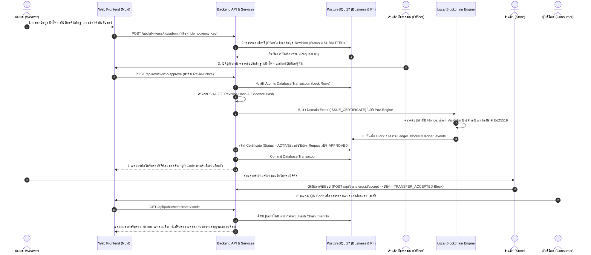

# 3. Actors & Transaction Flow — ผู้มีส่วนได้ส่วนเสียและกระบวนการทำงานของระบบ

## 3.1 ตารางวิเคราะห์ผู้มีส่วนได้ส่วนเสีย (Stakeholders & RBAC Analysis)

ระบบมีการกำหนดบทบาท อำนาจหน้าที่ และขอบเขตข้อห้ามที่ชัดเจนตามหลักการ Separation of Concerns และ Least Privilege ดังนี้:

| กลุ่มผู้ใช้งาน / บทบาท (Role) | บทบาทหน้าที่ในห่วงโซ่คุณค่า | สิทธิ์การดำเนินการในระบบ (Allowed Actions) | ข้อห้ามและสิ่งที่ทำไม่ได้ (Restrictions / Disallowed) |
|---|---|---|---|
| **1. ช่างทอผ้าไหม (`WEAVER`)** | สมาชิกชุมชนผู้ผลิตผ้าไหมทอมือในจังหวัดบุรีรัมย์ | • ลงทะเบียนผ้าไหมชิ้นใหม่ (`POST /api/silk-items`)<br>• จัดการข้อมูลร่าง (`Draft Revisions`)<br>• อัปโหลดภาพถ่ายและหลักฐานการผลิต (`POST /evidence`)<br>• ส่งคำขอรับรอง (`POST /submit`)<br>• ดูประวัติคำขอและข้อเสนอแนะในการแก้ไข | • ไม่อนุมัติหรือออกใบรับรองให้ตนเองได้<br>• ไม่สามารถแก้ไขข้อมูล Revision ที่ส่งตรวจหรืออนุมัติแล้วได้<br>• ไม่สามารถเข้าถึงข้อมูลส่วนบุคคลของช่างทอรายอื่นได้<br>• ไม่สามารถเขียนลง Ledger ได้โดยตรง |
| **2. เจ้าหน้าที่สหกรณ์ (`COOPERATIVE_OFFICER`)** | ตัวแทนสหกรณ์ผ้าไหมบุรีรัมย์ ผู้ทำหน้าที่ตรวจสอบมาตรฐานและออกใบรับรอง | • เรียกดูคิวคำขอรอตรวจ (`GET /api/reviews`)<br>• ตรวจสอบข้อมูลผ้าและหลักฐานทางกายภาพ<br>• อนุมัติคำขอเพื่อสร้างใบรับรอง (`POST /approve`)<br>• ปฏิเสธคำขอพร้อมระบุเหตุผล (`POST /reject`)<br>• สั่งระงับ/คืนสถานะ/เพิกถอนใบรับรอง (`POST /status`) | • ไม่สามารถแก้ไขข้อมูลเนื้อหาผ้าไหมของช่างทอโดยพลการ<br>• ไม่สามารถลบหรือแก้ไขประวัติใบรับรองที่บันทึกลง Ledger แล้วได้<br>• ไม่สามารถปลอมแปลงผลการลงนามของโหนดผู้ตรวจสอบอื่นได้ |
| **3. ร้านค้าและตัวแทนจำหน่าย (`STORE_USER`)** | ผู้รับซื้อและจัดจำหน่ายผ้าไหมบุรีรัมย์สู่ตลาด | • ตรวจสอบความถูกต้องของใบรับรองและประวัติผ้าไหม<br>• รับคำขอส่งมอบการครอบครอง (`Custody Transfer`)<br>• ยืนยันการรับมอบ (`POST /accept`) หรือปฏิเสธ (`POST /reject`)<br>• ตรวจสอบรายการผ้าไหมที่อยู่ในความดูแลของร้านตนเอง | • ไม่สามารถแก้ไขข้อมูลแหล่งกำเนิดหรือข้อมูลผู้ทอได้<br>• ไม่สามารถออกใบรับรองใหม่ หรือเปลี่ยนสถานะใบรับรองได้<br>• ไม่สามารถส่งมอบผ้าที่ตนเองไม่ได้เป็นผู้ถือครองในปัจจุบันได้ |
| **4. ผู้บริโภคและสาธารณชน (`PUBLIC_CONSUMER`)** | ผู้ซื้อผ้าไหม นักท่องเที่ยว และบุคคลทั่วไป | • สแกน QR Code หรือกรอกรหัสใบรับรองเพื่อตรวจสอบย้อนกลับ<br>• ดูข้อมูลผ้าไหม, แหล่งผลิต, ช่างทอ (แบบเปิดเผยได้), ผู้ออกใบรับรอง และไทม์ไลน์การส่งมอบ<br>• เข้าใช้งาน Blockchain Explorer เพื่อตรวจสอบความถูกต้องสมบูรณ์ของสายโซ่ (Chain Integrity) | • ไม่สามารถเข้าถึงข้อมูลส่วนบุคคลเชิงลึก (PII) เช่น ที่อยู่ หรือเบอร์โทรศัพท์ช่างทอ<br>• ไม่สามารถดูบันทึกการตรวจภายในของเจ้าหน้าที่ได้<br>• ไม่มีสิทธิ์ส่งคำขอ สร้าง หรือแก้ไขข้อมูลใดๆ ในระบบ |
| **5. โหนดผู้ตรวจสอบ (`POA_VALIDATOR_AUTHORITY`)** *(จำลอง)* | องค์กรผู้ดูแลฉันทามติ 3 ฝ่าย (สหกรณ์, หน่วยงานตรวจรับรอง, เครือข่ายร้านค้า) | • ตรวจสอบความถูกต้องของ Domain Event และลำดับ Nonce<br>• ลงนามรับรองบล็อกด้วย Ed25519 Private Key ตามรอบ Round-Robin<br>• บันทึกบล็อกใหม่ลงใน `ledger_blocks` แบบ Append-only | • ไม่สามารถสร้างบล็อกโดยข้ามรอบหรือใช้ Nonce ซ้ำได้<br>• ไม่สามารถแก้ไขบล็อกเก่าในอดีตได้ (ฝ่าฝืน Hash Chain Rules)<br>• ไม่สามารถเข้าถึงหรือแก้ไขข้อมูลธุรกิจระดับแอปพลิเคชันโดยตรง |

---

## 3.2 แผนภาพและขั้นตอนการทำงาน 8 ขั้นตอน (End-to-End 8-Step Transaction Flow)

กระบวนการออกใบรับรองและตรวจสอบย้อนกลับตั้งแต่ต้นน้ำ (ช่างทอ) จนถึงปลายน้ำ (ผู้บริโภค) สรุปเป็น 8 ขั้นตอนสำคัญดังนี้:



### คำอธิบายรายละเอียด 8 ขั้นตอน:

1. **ช่างทอสร้างข้อมูลและส่งคำขอ (Submit Request):** ช่างทอบันทึกรายละเอียดผ้าไหม (ลาย, ขนาด, สี, เทคนิคการย้อม) แนบภาพถ่ายกระบวนการทอ และกดส่งคำขอรับรอง
2. **ระบบตรวจสอบและล็อกข้อมูล (Validate & Lock Revision):** ระบบตรวจสอบความครบถ้วนของข้อมูล ล็อกสถานะ Revision เป็น `SUBMITTED` เพื่อป้องกันการแก้ไขในระหว่างการตรวจสอบ
3. **สหกรณ์ตรวจรับรอง (Cooperative Inspection):** เจ้าหน้าที่สหกรณ์ตรวจสอบความถูกต้องของข้อมูลและหลักฐานทางกายภาพ พร้อมบันทึกความเห็นการตรวจ (Review Note)
4. **เริ่มต้นกระบวนการแบบ Atomic (Transaction Initialization):** ระบบเริ่ม Database Transaction ทำการล็อกแถวข้อมูลที่เกี่ยวข้อง และคำนวณ Cryptographic Hash ของข้อมูลผ้าทั้งหมด
5. **การสร้างบล็อกและการลงนามฉันทามติ PoA (PoA Block Consensus):** ระบบเลือก Authority Validator ตามรอบ Round-Robin, ตรวจสอบ Nonce, คำนวณ Block Hash และลงนามด้วย Ed25519 Private Key
6. **บันทึกลงบัญชีธุรกรรมถาวร (Commit to Immutable Ledger):** บันทึกบล็อกลงในตาราง `ledger_blocks` ที่มี DB Trigger ป้องกันการแก้ไข/ลบ และสร้างใบรับรองสถานะ `ACTIVE`
7. **การส่งมอบการครอบครอง (Custody Transfer):** เมื่อผ้าถูกส่งต่อให้ร้านค้า ระบบบันทึก Event `TRANSFER_ACCEPTED` ลงบนบล็อกเชน ทำให้ไทม์ไลน์การส่งมอบโปร่งใสและตรวจสอบได้
8. **การตรวจสอบย้อนกลับโดยผู้บริโภค (Public Verification):** ผู้บริโภคสแกน QR Code บนผืนผ้า ระบบจะทำการ Query ข้อมูล พร้อมคำนวณ Hash Chain แบบ Real-time เพื่อยืนยันว่าข้อมูลไม่เคยถูกแก้ไขย้อนหลัง

---

## 3.3 แบบจำลองสถานะของระบบ (State Transition Models)

ระบบมีการควบคุมวงจรชีวิต (Lifecycle) ของข้อมูลอย่างเข้มงวดผ่าน State Machines 3 รูปแบบ:

### 3.3.1 สถานะของข้อมูลผ้าไหม (Silk Item Revision Status)
```
[DRAFT] --(ส่งคำขอ / submit)--> [SUBMITTED] --(สหกรณ์อนุมัติ)--> [APPROVED]
                                     |
                                     +--(สหกรณ์ปฏิเสธ)--> [REJECTED]
```
* **`DRAFT`:** ช่างทอกำลังแก้ไขข้อมูล สามารถเพิ่ม/ลบรูปภาพและรายละเอียดได้
* **`SUBMITTED`:** ส่งเข้าคิวตรวจ ข้อมูลถูกล็อก ห้ามแก้ไข
* **`APPROVED`:** ผ่านการตรวจรับรองและถูกบันทึกลง Ledger เรียบร้อยแล้ว (ไม่สามารถย้อนกลับได้)
* **`REJECTED`:** ไม่ผ่านการตรวจ ช่างทอต้องสร้าง Revision ใหม่จากของเดิมเพื่อส่งตรวจซ้ำ

### 3.3.2 สถานะของใบรับรองดิจิทัล (Certificate Status)
```
                 +---(พบข้อสงสัยชั่วคราว)---> [SUSPENDED]
                 |                                 |
                 v                                 | (ตรวจแล้วถูกต้อง)
[สร้างใบรับรอง] ---> [ACTIVE] <-----------------------+
                 |
                 +---(พบการปลอมแปลง/ฝ่าฝืนร้ายแรง)---> [REVOKED] (สิ้นสุดถาวร)
```
* **`ACTIVE`:** ใบรับรองถูกต้อง ใช้งานได้ปกติ
* **`SUSPENDED`:** ถูกระงับชั่วคราวเพื่อตรวจสอบเพิ่มเติม (สามารถคืนสถานะเป็น `ACTIVE` ได้)
* **`REVOKED`:** ถูกเพิกถอนถาวรเนื่องจากพบการกระทำผิดมาตรฐาน ไม่สามารถนำกลับมาใช้ได้อีก

### 3.3.3 สถานะการส่งมอบการครอบครอง (Custody Transfer Status)
```
[เริ่มส่งมอบ] ---> [PENDING] --(ร้านค้ายืนยันรับ)--> [ACCEPTED] (บันทึกลง Ledger)
                      |
                      +--(ร้านค้าปฏิเสธ)--------> [REJECTED]
                      +--(ผู้ส่งกดยกเลิก)---------> [CANCELLED]
                      +--(หมดอายุเวลา)----------> [EXPIRED]
```
